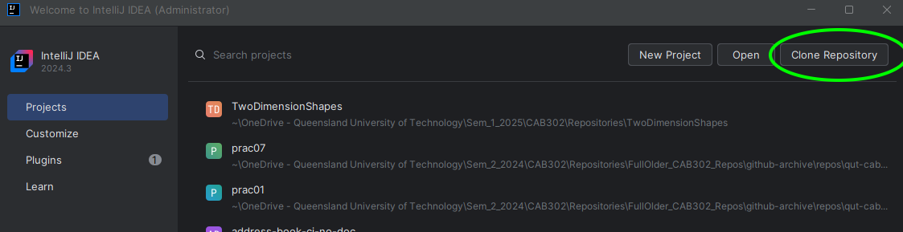
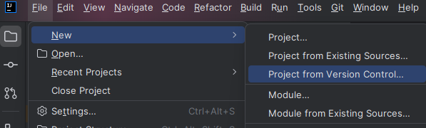
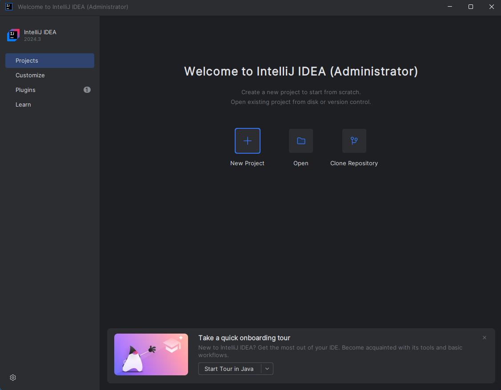
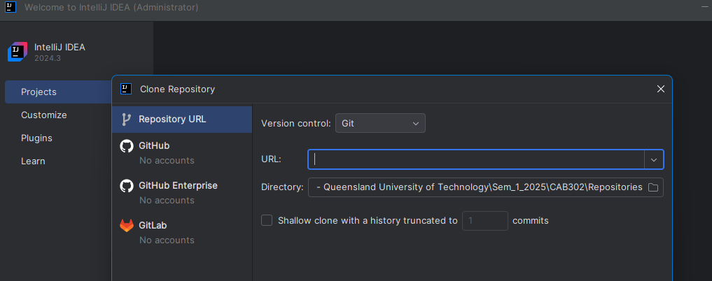
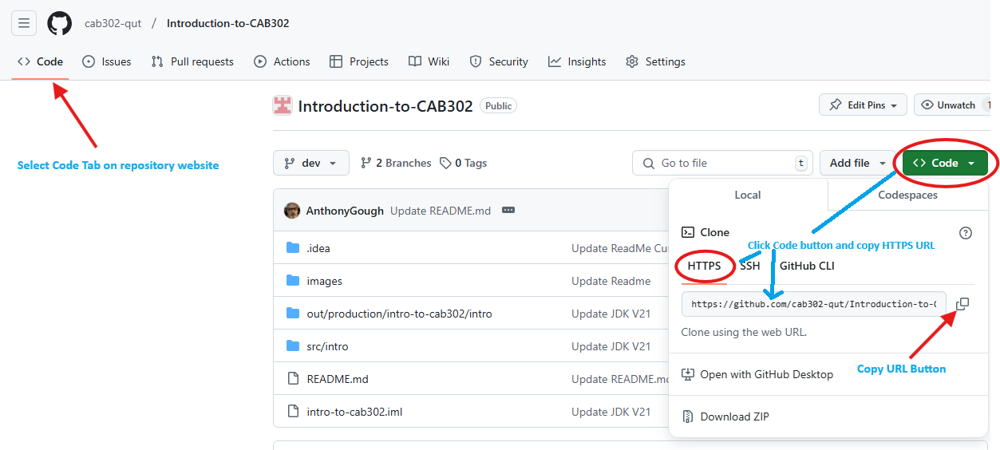
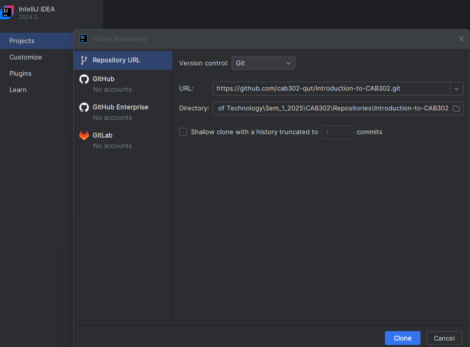
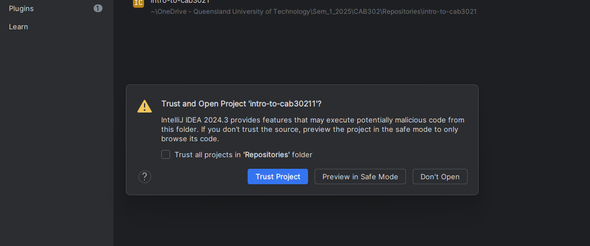
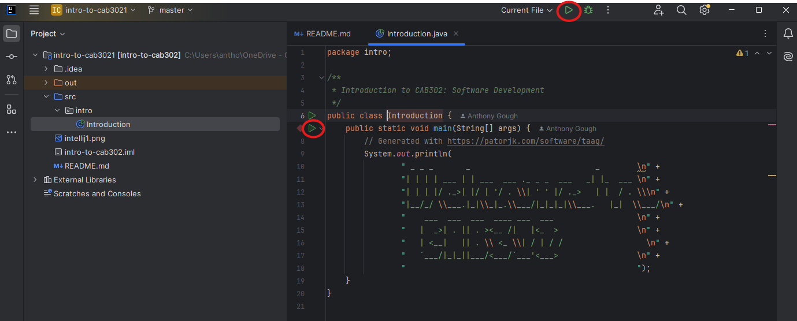
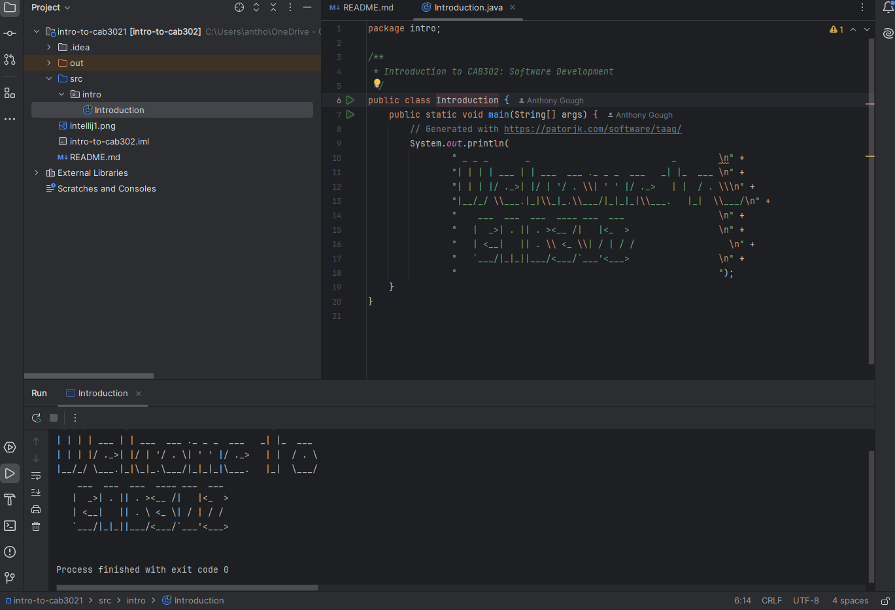

# Introduction to CAB302

This exercise is to familiarise yourself with cloning projects from a remote Git repository. Most of the CAB302 practicals be delivered this way, requiring you to clone the repository containing the practical to your local machine. So it is essential to understand how to clone a remote repository. All of the practical material will be hosted on GitHub so it is worth creating your own personal account on GitHub - we would recommend to use your QUT email address.

There are two detailed guides that have been provided on the CAB302 Canvas site **(Activity 0.1 & Activity 0.2)**. We expect that you will have completed both these activites in advance of Week 1 CAB302 Lecture and Practicals. You will need to complete these activities prior to cloning this repository. If you have not yet done these please complete both activities before attempting to clone this repository.
1. **Activity 0.1** - How to setup the Integrated Development Environment (IDE) required for CAB302
2. **Activity 0.2** - Testing the IDE setup and configuration is correct

There are a number of ways to clone a remote repository, however, for the moment we will be using IntelliJ IDEA. If you prefer to use Git Bash (Bourne Again Shell) and are familiar with the command line utility, then you can certainly go down that path. Most students will probably prefer to let IntelliJ IDEA do all the heavy lifting when starting out working with source/version control. 

## Clone Repository Options
First you will need to start IntelliJ IDEA. When you start IntelliJ IDEA and if you had previously been working on a project that has not been closed, that same project will automatically load when re-starting IntelliJ IDEA. To get access to the controls to clone a remote respository you will need to close the current project. Once the project is closed the Welcome Screen will appear, similiar to the image in figure 1.

Figure 1 - IntelliJ IDEA Clone Repository from Welcome Screen/Launcher

The other option is to save any changes to the current project then select **File --> New --> Project from Version Control** (see figure 2)

  
Figure 2 - IntelliJ IDEA Clone Repository using File Menu

However, if this is your first time launching IntelliJ IDEA, you will be greeted by the IntelliJ IDEA launcher, which will look something like the following in figure 3. Use the **Clone Repository** to open the Clone Repository dialogue screen. 

Figure 3 - IntelliJ IDEA Clone Repository Welcome Screen/Launcher

### Problems cloning due to GIT

When cloning a repository if you receive an error message stating that Git is not installed, then you need to install Git before attempting to clone the repository again. If you have already completed **Activity 0.1 & Activity 0.2** then you should have already confirmed that Git is installed. If you have installed Git and it still gives you this message, you will need to configure IntelliJ IDEA to explicitly define the Git executable location. All of the configuration details on how to accomplish this is described in  **Activity 0.1**. In most cases, the problem is due to the incorrect installation order of:
1. Amazon Corretto Version 21.
2. GIT (Current Version 2.47.1)
3. IntelliJ IDEA (Current Version 2024.3).

If you cannot rectify the problem, the best (and quickest) solution is to completely uninstall IntelliJ IDEA, then uninstall Git, and finally and most importantly, reboot your computer.
Follow the installation instructions in **Activity 0.1** which advises to install in the order that follows:
1. **First Install Git**
2. **Second application to install IntelliJ IDEA - Make sure Git has been installed completely.**
**NOTE: The is no need to uninstall Amazon Corretto.**

Follow the instructions in **Activity 0.1** on Canvas as there are detailed instructions and screen-shots to assist the correct installation procedure.
---

### Clone Repository Dialogue Screen

Regardless of how you are going to clone the repository using IntelliJ IDEA, the same dialogue screen will appear as in figure 4. You will need to get the URL of the repository you want to clone and set the directory where the cloned repository is to be stored on your hard drive. When cloning a repository you will need to select a new directory otherwise an error message will appear that states `"The directory already exists and is not empty"`. It is a good idea to keep your repositories ordered in a consistent way such as by Week Number or Practical Number so you can locate the repositories on your hard drive easily.

Figure 4 - IntelliJ IDEA Clone Repository Dialogue Screen

You will need to copy the URL of the repository you want to clone from GitHub and paste it in the URL field. To get this address, go to the remote repository and click the **Code** button and make sure to select **HTTPS** to get the correct URL address. See figure 5.
**Note: You can use SSH however you will need to configure/create SSH keys (public & private) and load the public key into your GitHub account.** 
This is not in the scope of this exercise, however, it is not difficult to configure SSH keys and there are many sites that document the process. You will find instructions for Windows, MacOS and Linux, however for the time being we recommend to keep it simple and use the **HTTPS URL Address**. A link to how to implement SSH is provided at the end of this page.

Figure 5 - HTTPS URL address to copy to clone repository

You will also need to enter the directory where you want to clone the project into. Once you have completed this select the **Clone** button in IntelliJ IDEA and if everything is correct, the project will be cloned from the remote repository to your hard drive into the directory you specified. See figure 6.

.
Figure 6 - URL and Directory configured on remote repository clone dialogue

If a dialog pops up asking if you trust this project, choose to trust it. IDEA should now download the project files and open the project. See figure 7

.
Figure 7 - Trust and Open Project when trying to clone repository

# Running the project

If all goes well, you should just be able to navigate to **src -> intro -> Introduction** to open up the main source file for the project. From there, click one of the green arrows (either the one next to the class definition or the one next to the main method) and click Run 'Introduction.main()' to run the program, which should show 'Welcome to CAB302' in ASCII art. See figure 8 & 9.
If the green arrows are not present, look at the top of the source file window - there may be a message there saying that the JDK is not set up. Clicking that message should allow you to select **Amazon Corretto 21** and resolve that problem.

.
Figure 8 - Running the cloned application from main method

.
Figure 9 - Execution of the cloned application

[Link to Adding a new SSH key to your GitHub account](https://docs.github.com/en/enterprise-cloud@latest/authentication/connecting-to-github-with-ssh/adding-a-new-ssh-key-to-your-github-account)
