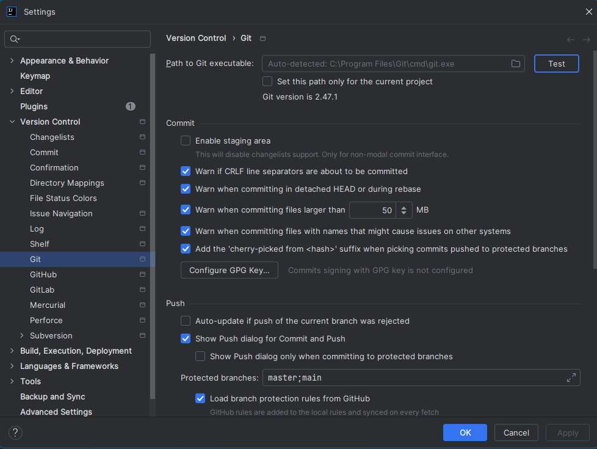

# Introduction to CAB302

This exercise is to familiarise you with cloning projects from a remote Git repository so that you can work on them in IntelliJ IDEA on your own machine. Most CAB302 practicals will work this way - the first step you will take is cloning a Git repository.

First, you need to run IntelliJ and get ready to clone from a remote version control system. There are two main ways you might do this. Note that these instructions are for Windows, but everything should be fairly similar in Linux and Mac OS (Git will not have the filename `git.exe`, of course).

### From the IntelliJ IDEA launcher

When you launch IDEA, if you had a project open when you last used it, that project will re-open automatically. If the last project was closed, you may also have a list of recently opened projects displayed on the welcome screen.

However, if this is your first time launching IDEA or you closed the current project, you will be greeted by the IntelliJ IDEA launcher, which will look something like the following (Note: The version numbers may be slightly different depending on the installation date):

From here, you can click **'Get from VCS'** to clone a project from a remote repository. If you try this and you get a message saying that Git is not installed, then you need to install Git first. If you've installed Git and it still gives you this message, you will need to configure IntelliJ IDEA to explicitly define the Git executable location.

From the File menu in IntelliJ IDEA, click 'Settings', then select 'Version Control', and finally Git. The screen will appear as shown below with a section to enter 'Path to Git executable'. In Windows, it will generally be in 'Program Files\Git\cmd\git.exe'. The important point is that you need to provide the location of 'git.exe' and not just the install directory for Git. 

There is a folder icon you can use to browse with Windows explorer to help locate the Git executable. If you followed the CAB302 IDE Configuration Video setup guide then hopefully this will not be an issue. However, if you installed the applications in the wrong order then it is possible IntelliJ IDEA does not know the Git executable location. 

Once you have located the Git exectable there is a 'Test' button in the Version Control section of IntelliJ IDEA settings - click the 'Test' button and if you have found the Git executable (git.exe) then the display will show the version installed on your system.
**NOTE: Do not check 'Set this path only for the current project** as you will need Git for the entire semester in CAB302.

### From inside an IntelliJ IDEA project

If you already created a project in IntelliJ, you will instead need to clone the project by going to File -> New -> Project from Version Control. This will open up the same dialog as before. If Git is not installed properly, go to File -> Settings, then follow the instructions from the previous section to tell it where your Git executable is.

# Cloning the project

Once you have clicked 'Project from Version Control' / 'Get from VCS' and have Git installed and working, you should be looking at a prompt with a text field titled 'URL:' and a file browser field titled 'Directory:'. You will need to get the project's URL from GitHub and put it in the URL field.

From the GitHub page of the project, click on the green 'Code' button. This will open up a small window. First, make sure 'HTTPS' is selected, then copy the URL. Paste the URL into IDEA and click 'Clone'. You can also change the directory if you would prefer to keep your projects in another location.

If a dialog pops up asking if you trust this project, choose to trust it. IDEA should now download the project files and open the project.

# Running the project

If all goes well, you should just be able to navigate to src -> intro -> Introduction to open up the main source file for the project. From there, click one of the green arrows (either the one next to the class definition or the one next to the main method) and click Run 'Introduction.main()' to run the program, which should show 'Welcome to CAB302' in ASCII art. If the green arrows are not present, look at the top of the source file window - there may be a message there saying that the JDK is not set up. Clicking that message should allow you to select Amazon Corretto 17 and resolve that problem.
