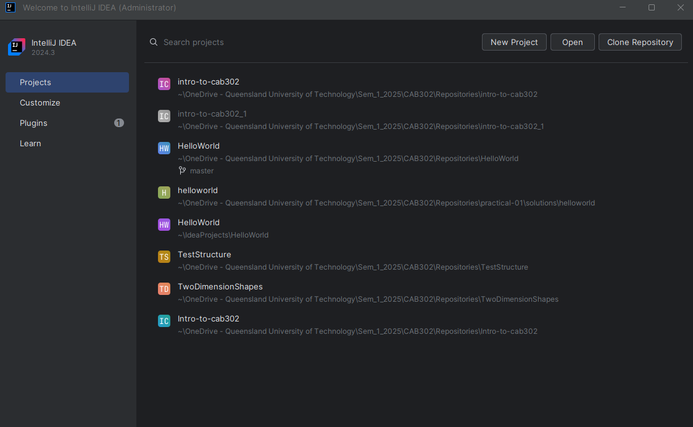
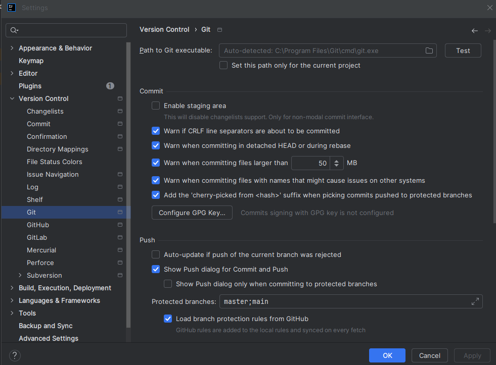
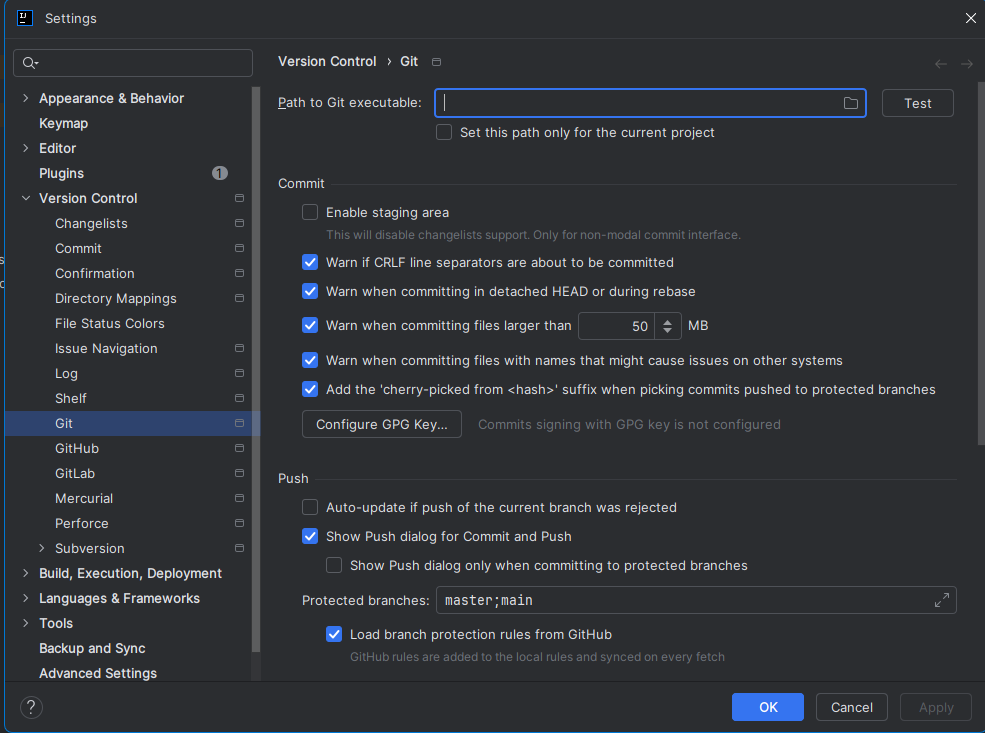
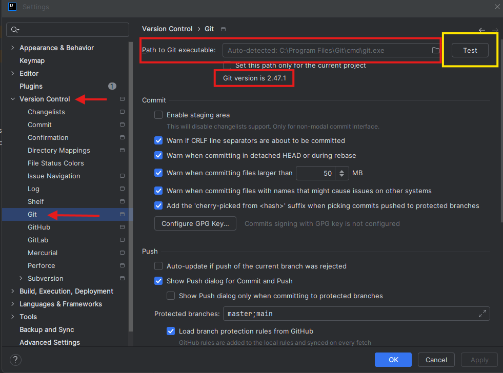
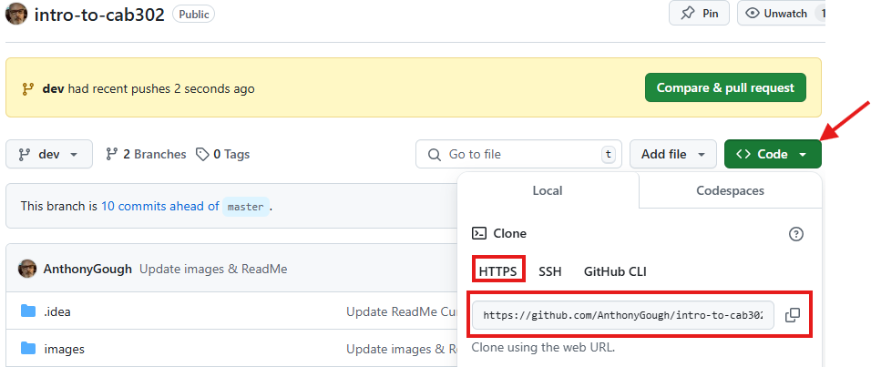
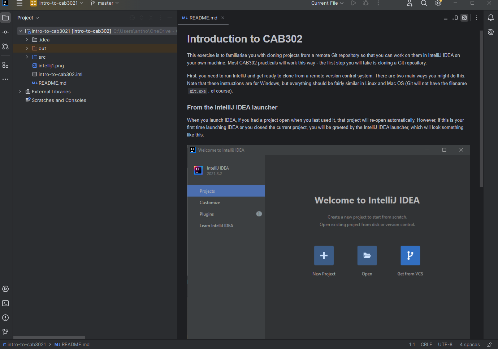

# Introduction to CAB302

This exercise is to familiarise yourself with cloning projects from a remote Git repository. Most of the CAB302 practicals be delivered this way, requiring you to clone the repository containing the practical to your local machine. So it is essential to understand how to clone a remote repository.  

Detailed guides have been provided on the CAB302 Canvas site. We expect that you have already completed Activity 0.1 and Activity 0.2 in advance of the Week 1 Lecture and Practicals. You will need to complete these activities before you clone this repository so if you have not done so please complete these activites on Canvas first.
1. Activity 0.1 - How to setup the Integrated Development Environment (IDE) required for CAB302
2. Activity 0.2 - Testing the IDE setup and configuration is correct

There are a number of ways to clone a remote repository, however, for the moment we will be using IntelliJ IDEA to clone the repository. If you prefer to use Git Bash (Bourne Again Shell) and are familiar with the command line utility then you can certainly go down that path. Most students will probably prefer to let IntelliJ IDEA do all the heavy lifting rather than using a command line utility. To get started you will need to start IntelliJ IDEA.
First, you need to run IntelliJ and get ready to clone from a remote version control system. There are two main ways you might do this. Note that these instructions are for Windows, but everything should be fairly similar in Linux and MacOS (Git will not have the filename `git.exe`, of course).

### Confirm Git Installation

When you launch IDEA, if you had a project open when you last used it, that project will re-open automatically. If the last project was closed, you may also have a list of recently opened projects displayed on the welcome screen.

However, if this is your first time launching IDEA or you closed the current project, you will be greeted by the IntelliJ IDEA launcher, which will look something like the following **(Note: The version numbers may be slightly different depending on the installation date)**:

From here, you can click **'Get from VCS'** to clone a project from a remote repository. If you try this and you get a message saying that Git is not installed, then you need to install Git first. If you've installed Git and it still gives you this message, you will need to configure IntelliJ IDEA to explicitly define the Git executable location.

From the File menu in IntelliJ IDEA, click 'Settings', then select 'Version Control', and finally Git. The screen will appear as shown below with a section to enter 'Path to Git executable'. In Windows, it will generally be in 'Program Files\Git\cmd\git.exe'. The important point is that you need to provide the location of 'git.exe' and not just the install directory for Git. 

There is a folder icon you can use to browse with Windows explorer to help locate the Git executable. If you followed the CAB302 IDE Configuration Video setup guide then hopefully this will not be an issue. However, if you installed the applications in the wrong order then it is possible IntelliJ IDEA does not know the Git executable location. 

Once you have located the Git exectable there is a 'Test' button in the Version Control section of IntelliJ IDEA settings - click the 'Test' button and if you have found the Git executable (git.exe) then the display will show the version installed on your system.
**NOTE: Do not check 'Set this path only for the current project'** as you will need Git for the entire semester in CAB302.

### Cloning a project from within IntelliJ IDEA 

If you already working in IntelliJ, and you need to clone a repository, you will instead need select **File -> New -> Project from Version Control**. This will open up a dialog similar to the image below. If Git is not installed properly, refer to the previous section to configure Git.

You will need to copy the project's URL from GitHub and paste it in the URL field. To get this address, go to the remote repository and click the **Code** button and make sure to select **HTTPS** to get the correct URL to clone. 

You will also need to enter the directory where you want to clone the project into. Once you have completed this select the **Clone** button in IntelliJ IDEA and if everything is correct, the project will be cloned from the remote repository to your hard drive into the directory you specified.
.

If a dialog pops up asking if you trust this project, choose to trust it. IDEA should now download the project files and open the project.
.

### Cloning a project IntelliJ IDEA Start screen

You can select **Clone Repository** from the IntelliJ IDEA Welcome Screen. If you click **Clone Repository** the same dialog screen will appear as before and you will still need to enter the URL of the project you want to clone, as well as select the destination directory on your hard drive. Once this is completed and you click **Clone** the project will load into IntelliJ IDEA.
.

# Running the project

If all goes well, you should just be able to navigate to **src -> intro -> Introduction** to open up the main source file for the project. From there, click one of the green arrows (either the one next to the class definition or the one next to the main method) and click Run 'Introduction.main()' to run the program, which should show 'Welcome to CAB302' in ASCII art. If the green arrows are not present, look at the top of the source file window - there may be a message there saying that the JDK is not set up. Clicking that message should allow you to select **Amazon Corretto 21** and resolve that problem.
.
.
